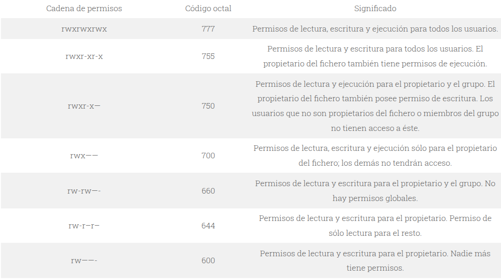

# Parte_01

## Bienvenidos al Curso de Linux Intermedio en donde se mostraran las bases de Linux de manera que nos ayudaran a profyuncizar en el mundo de GNU/Linux.

### Primeros Pasos:

#### 1 - Ejecucion de un entorno Linux en una maquina Virtual e interaccion inicial con la terminal.

 - Abrir Maquina Virtual e inicializar el sistema.
 - Un vistazo a los programas disponibles que hay 
 - Usuario: **userlisa** | Contraseña: **12345**
 - Abrimos nuestra terminal con el atajo: **Ctrl+Alt+T**
 - Ejecutamos nuestro primer comando escribiemdo en la terminal:
> **~$** neofetch
##### _Muestra informacion del sistema._
> **~$** clear
##### _Limpia nuestra terminal._
> **~$** pwd
##### _Nos muestra donde estamos._
> **~$** ls
##### _Nos muestra el contenido de la ubicacion._
> **~$** ls -l
##### _Nos muestra el contenido de la ubicacion pero con mas detalles._
> **~$** sudo apt-get update
##### _Actualiza nuestros repositorios y es recomendarlo hacerlo siempre que actualicemos sistema o actualicemos o instalemos paquetes(debemos poner la contraseña: **12345** )._
> **~$** cd
##### _Permite movermos de ubcacion._
> **~$** mkdir [nombre]
##### _Permite crear una carpeta._
> **~$** rmdir [nombre]
##### _Permite eliminar una carpeta._
> **~$** touch [nombre.extension]
##### _Permite crear un archivo._
> **~$** rm [nombre.extension]
##### _Permite eliminar un archivo._
> **~$** nano [nombre.extension]
##### _Abre un editor de texto en terminal, es bastanet util._
> **~$** cat [nombre.extension]
##### _muestra el contenido del archivo._
> **~$** tree [nombre.extension]
##### _muestra un arbol desplegando ubicaciones y archivos contenidos en el directorio actualel contenido del archivo._

#### Ejercicio

### En el escritorio, hacer el siguiente arbol de directorios y mostrar al final con  **~$ tree**.

```bash
Arbol/
├── ciencias
│   ├── biologia
│   │   └── celulas.txt
│   ├── fisica
│   └── quimica
├── historia
│   ├── antigua
│   │   └── egipto.txt
│   ├── medieval
│   └── moderna
└── matematicas
    ├── algebra
    │   └── ecuaciones.txt
    ├── calculos
    │   ├── derivadas
    │   │   └── ejercicios.txt
    │   └── integrales
    └── geometria
        └── teoremas.txt
```

#### 2 - Mas comandos de utilidad...

> **~$** mv [/directorio/archivo.pdf] [/directorio/subdirectorio/]
##### _Permite mover a otro directorio y renombrar un archivo._
> **~$** cp [/directorio/archivo.pdf] [/directorio/archivo2.pdf]
##### _Permite copiar un archivo._
> **~$** history
##### _Muestra el historial de comandos ejecutados._
> **~$** man [Comando]
##### _Muestra opciones y argumentos que se pueden usar con el comando indicado._
> **~$** chmod
##### _Comando para el manejo de permisos._


[Pagina del comando **chmod** detallado](https://www.ochobitshacenunbyte.com/2018/08/09/permisos-de-archivos-en-linux/)

#### 3 - Scripts...

#### Ejercicio

Usando lo visto hasta ahora, haremos nuestro primer Script que se ejecute en la terminal de Linux

Recordemos guardar el archivo con extension .sh

```bash
#!/bin/sh

# Esto es un comentario!
echo "Curso Linux Intermedio" # TAMBIEN

```
Tambien debemos cambiar el permiso del archivo con:

> **~$** chmod +x [nombre_de_script.sh]

Ejecutar de la forma:

> **~$** ./nombre_de_script.sh

[Enlace para profundizar en Scripts](https://www.shellscript.sh/) <-- Aqui

Probar el siguiente Script:
```bash
#!/bin/bash

echo "=========================================="
echo "    INFORMACIÓN DEL SISTEMA Y CONTADOR    "
echo "=========================================="
echo ""

echo "--- VARIABLES DE ENTORNO ---"
echo "Usuario actual: $USER"
echo "Shell: $SHELL"
echo "Directorio home: $HOME"
echo "Path: $PATH"
echo "Directorio actual: $PWD"
echo "ID del proceso: $$"
echo ""

echo "--- INFORMACIÓN DEL SISTEMA ---"
echo "Hostname: $(hostname)"
echo "Sistema operativo: $(uname -s)"
echo "Arquitectura: $(uname -m)"
echo ""

echo "--- CONTADOR REGRESIVO ---"
echo "El contador iniciará en 5 segundos..."
sleep 2

for i in {5..1}; do
    echo "Contador: $i"
    sleep 1
done

echo "¡TIEMPO COMPLETADO!"
echo ""

echo "--- CONTADOR PROGRESIVO (hasta 3) ---"
for i in {1..3}; do
    echo "Segundo: $i"
    sleep 1
done

echo ""
echo "=========================================="
echo "        SCRIPT FINALIZADO                 "
echo "=========================================="
```

> **~$** env [nombre]
##### _Permite ver variables de entorno_

Finaliza Unidad 1.

