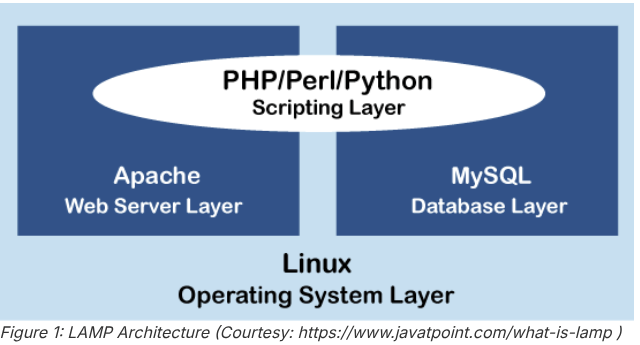

# Parte_02

## Haciendo de nuestro sistema, Servidor LAMP(Linux, Apache, MySQL y PHP)


[CONCEPTO](https://www.liquidweb.com/blog/what-is-a-lamp-stack/)

Lo haremos de la siguiente manera:

1. Install Apache: sudo apt-get install apache2.

2. Install MySQL: sudo apt-get install mysql-server.

3. Install PHP: sudo apt-get install php libapache2-mod-php php-mysql.

4. Reiniciar Apache

[PROFUNDIZACION](https://www.digitalocean.com/community/tutorials/how-to-install-lamp-stack-on-ubuntu)

### Sentando las bases para instalacion:

#### 1 Instalacion de las dependencias y servicios.

Primeramente debemos hacer el paso improtante de cualquier instalacion de paquetes:

> **~$** sudo apt-get update

> **~$** sudo apt-get install apache2

> **~$** systemctl status apache2

si vemos que esta **enabled** y **running** entonces estara hecho!

> **~$** sudo apt-get install chromium-browser

si vemos que esta **enabled** y **running** entonces estara hecho!

Instalamos un navegador de internet(Brave) y con el accedemos a la direccion **localhost** y si vemos lo siguiente, ya tendremos Apache listo.


Procedemos a instalar un SGBD(Sistema Gestor de Base de Datos)

> **~$** sudo apt-get install mysql-server

Procedemos a verificar:

> **~$** mysql --version

Entramos al SGBD:

> **~$** sudo mysql
##### _Ingresamos a la consola de MySQL._
> **misql>** exit
##### _Salir de la consola de MySQL._

Ahora creamos una base de datos:


> **~$** sudo mysql -u root -p

> **mysql>** CREATE DATABASE tienda;

```mysql
CREATE USER 'newuser'@'localhost' IDENTIFIED BY 'password';
```

```mysql
GRANT ALL PRIVILEGES ON * . * TO 'newuser'@'localhost';
```
```mysql
FLUSH PRIVILEGES;

```

> **mysql>** SHOW DATABASES;

> **mysql>** USE tienda;


```mysql
CREATE TABLE Productos (
  ProductoID INT PRIMARY KEY,
  NombreProducto VARCHAR(50),
  Descripcion VARCHAR(255),
  Precio DECIMAL(10, 2),
  Stock INT
);
```
```mysql
INSERT INTO Productos (ProductoID, NombreProducto, Descripcion, Precio, Stock)
VALUES 
  (1, 'Camiseta', 'Camiseta negra simple de talla unica', 10, 16),
  (2, 'Pantalon', 'Pantalon argo azul tipo chino', 20, 24),
  (3, 'Gorra', 'Gorra azul con el logo de los Yankees', 15, 32),
  (4, 'Zapatillas', 'Zapatillas de running de color blanco y verde', 35, 13);
  ```
```mysql
SELECT * FROM productos;
```

  Instalamos PHP

  > **~$** sudo apt install php libapache2-mod-php php-mysql

