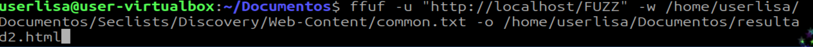
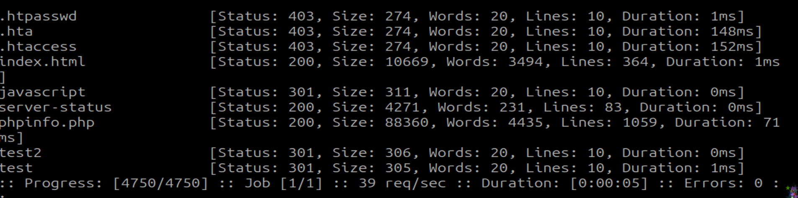

# Parte_04

## Probando un poco de ciberseguridad/pentesting

### Probaremos algunas herramientas que suelen venir incluidas en la distribucion de Kali Linux.

[¿Qué es Kali Linux y para qué se utiliza?](https://imaginaformacion.com/tutoriales/que-es-kali-linux)

[Pagina Oficial de Kali Linux](https://www.kali.org/)

1. ANÁLISIS DE METADATOS CON EXIFTOOL

> **~$** sudo apt-get update
##### _Actualizamos repositorios_

> **~$** sudo apt-get install exiftool
##### _Para analisis de metadatos_

> **~$** exiftool -GPSPosition *.jpg
##### _Para resatlar solo coordenadas GPS(si existen)._

```bash
# Añadir metadatos personalizados
exiftool -artist="CiberSeguridad" -copyright="Práctica Ética" test_image.jpg

# Eliminar todos los metadatos
exiftool -all= test_image_clean.jpg

```

2. FUZZING WEB CON FFUF

Ubicandonos en la carpeta de documentos, descargamos los diccionarios para el fuzzy:


> **~$** git clone https://github.com/danielmiessler/SecLists.git

##### _| ! | No se recomienda descargar en clase ya que los diccionarios suelen ser archivos muy grandes mayoresa 1GB. En este caso, 2.53GB_

### Para poder probar el funcionamiento de ffuf, se incluye en este repositorio, un archivo comun diccionario llamado diccionario.txt el cual es el mismo que se utiliza en la prueba. Se puede usar con normalidad este diccionario.

Una vez descargado los diccionarios, ejecutamos el comando:



mostrandonos nuestros directorios y archivos:



```bash
# 1. Fuzzing de directorios
ffuf -u "http://sitio-test.com/FUZZ" -w /usr/share/wordlists/dirb/common.txt

# 2. Fuzzing de subdominios
ffuf -u "http://FUZZ.sitio-test.com" -w /usr/share/wordlists/SecLists/Discovery/DNS/subdomains-top1million-5000.txt
```
3. ESCANEO CON NMAP

con sudo
```bash
# Escaneo TCP SYN (stealth)
nmap -sS 192.168.1.1

# Escaneo de rango específico
nmap -p 80,443,22,21 192.168.1.1

# Escaneo completo de puertos (1-65535)
nmap -p- 192.168.1.1

# Detección de versiones de servicio
nmap -sV 192.168.1.1

# Detección de sistema operativo
nmap -O 192.168.1.1
