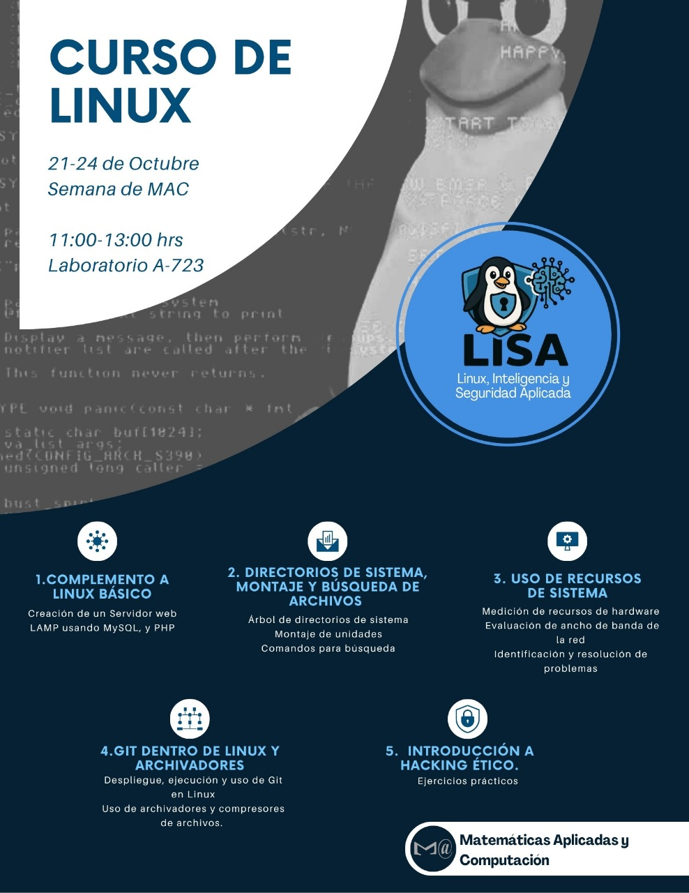

# CIL
## Repositorio del Curso intermedio de Linux.

### Horarios: 11am - 1pm
### Lugar: Laboratorio A-723

### Enlaces de Interes:

#### Utileria

[Editor de archivos Markdowd](https://stackedit.io/)

